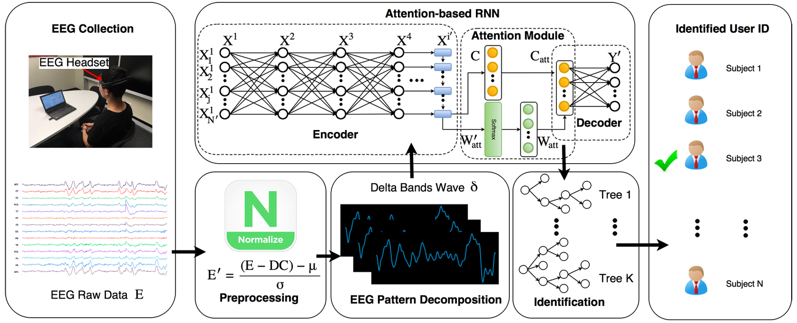

## A Tensorflow Implementation of Person identification from brain waves using Attention-based recurrent neural network

what the code does:

1. Define some helper functions for one-hot encoding and filtering signals.
2. Load EEG data from a Matlab file.
3. Preprocess the EEG data by applying a bandpass filter and scaling the features.
4. Split the preprocessed data into training and testing sets.
5. Reshape the training and testing data into the appropriate format for a recurrent neural network.
6. One-hot encode the training and testing labels.
7. Train and evaluate an XGBoost classifier on the preprocessed data.

This is an attempt to code the program in latest versions of tensorflow and keras
The Implementation is based on the paper, "[MindID: Person Identification from Brain Waves through
Attention-based Recurrent Neural Network](https://arxiv.org/pdf/1711.06149.pdf)"

## Flow Chart

### Datasets
- EID-M.mat, EID-S.mat are two local datasets, encoded in a matlab file

### Some Helpful links to Learn about LSTM & Recurrent Neural Networks

- [LSTM](http://colah.github.io/posts/2015-08-Understanding-LSTMs/)
- [Attention and Augmented Neural Networks](https://distill.pub/2016/augmented-rnns/)
